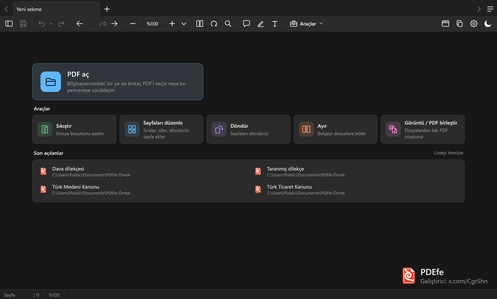
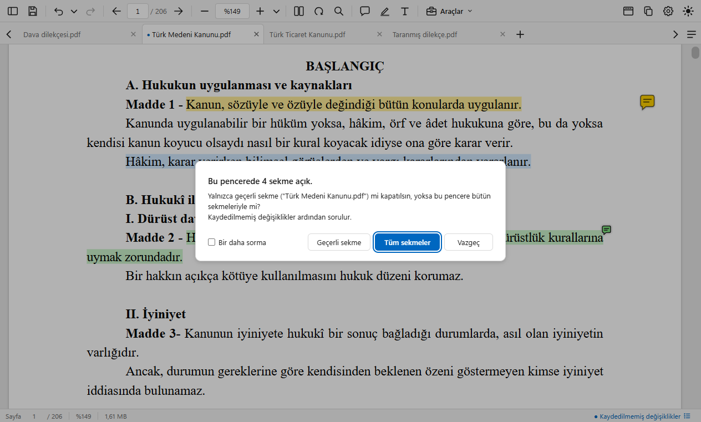
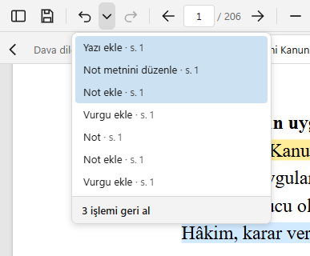
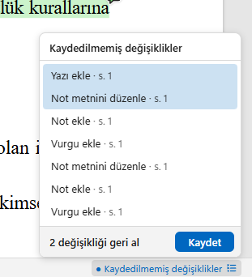
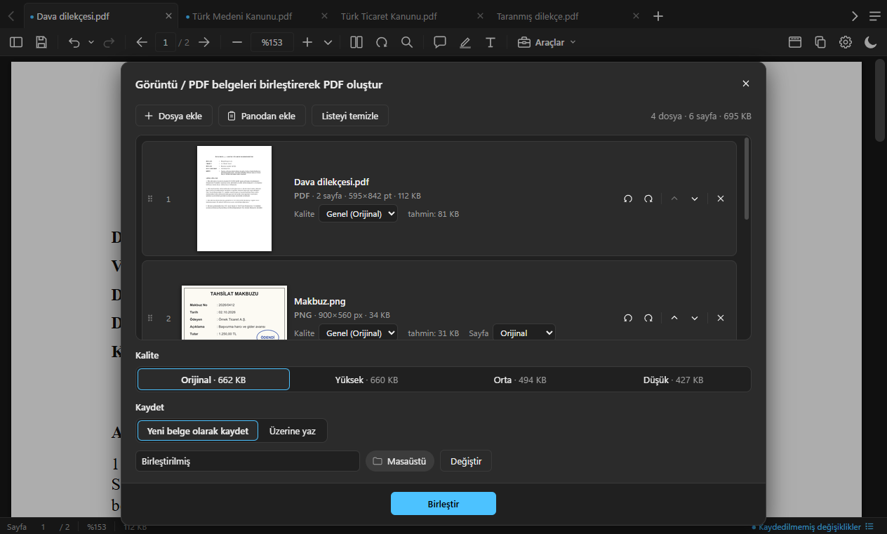
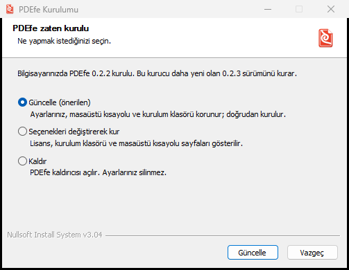

# PDEfe

### [⬇ Windows için indir (PDEfe-Setup.exe)](https://github.com/SCgrS/PDEfe/releases/latest/download/PDEfe-Setup.exe)
### [⬇ macOS için indir (PDEfe-Mac.dmg)](https://github.com/SCgrS/PDEfe/releases/latest/download/PDEfe-Mac.dmg)

Windows 11 (ve Windows 10) ile macOS için sade, tüm araçları ücretsiz, reklamsız bir **PDF görüntüleyici ve düzenleyici**.

Hukukçuların ve her gün onlarca PDF açan herkesin işini görmek için yazıldı. Belgeler sekmelerde açılır, metin kopyalandığında satır
sonları ve tireler temizlenir. PDF, JPEG ve PNG dosyalarını birleştirebilir, PDF'leri ayırabilir, döndürebilir, üzerine metin yazabilir,
boyutunu küçültebilir ve daha fazlasını yapabilirsiniz.

  

## Öne çıkanlar

- **Sekmeler ve pencereler:** Birden çok PDF tek pencerede açılır. Sekme sürüklenerek kendi penceresine ayrılır.
- **Temiz kopyalama:** Satırlar paragraf olarak birleşir, tireler kalkar. Metin UYAP Doküman Editörü'ne ve Word'e düzgün yapışır.
- **Araçlar:** Sıkıştır, Sayfaları düzenle, Döndür, Ayır, Görüntü / PDF birleştir.
- **Taranmış belgede seçim:** Taranmış sayfadaki yazı da fareyle seçilip kopyalanır. Bunu bilgisayarın kendi yazı tanıyıcısı çevrim dışı yapar.
- **Türkçe arama:** İ/ı ayrımı doğrudur. Bütün açık belgelerde birden aranabilir.
- **Standart PDF notları:** Vurgu, not ve yazı başka PDF okuyucularında da görünür, e-imzayı bozmaz.

## Ne yapar

Ekran görüntüleri Windows'ta alındı, macOS'ta görünüm aynıdır. Bütün kısayollar uygulamada `F1` ile açılan pencerededir.

  

### Açılış ekranı

Belge açık değilken **PDF aç** düğmesi, bütün araçlar ve son açılan 10 belge görünür. PDF'ler pencereye sürüklenerek de açılır. Son
açılanlar listesi istenmezse Ayarlar'dan kapatılır.

  
  

### Sekmeler ve pencereler

- **Sekmeler:** Birden çok PDF tek pencerede açılır. Sekmeler sürüklenerek sıralanır, orta tıkla kapanır. Kaydedilmemiş değişikliği olan
  sekmenin adının önünde nokta (•) durur. Belge yeniden açılınca kalınan sayfadan devam edilir.
- **Sağ tık:** Sekmede sağ tıkla belge kaydedilir, pencereye ayrılır, klasörde gösterilir ya da dosya olarak kopyalanır.
- **Pencereler:** Sekme, sekme çubuğunun dışına sürüklenince kendi penceresinde açılır. Başka bir PDEfe penceresine bırakılınca oraya
  geçer. Notlar ve geri al geçmişi sekmeyle birlikte taşınır.
- **Kapatma:** Birden çok sekmeli pencere kapatılırken yalnızca geçerli sekmenin mi, bütün sekmelerin mi kapanacağı sorulur. Seçim
  hatırlanabilir. Kaydedilmemiş belge varsa kaydetmek isteyip istemediğiniz sorulur.

### Görünüm

- **Keskin ve akıcı:** Yazılar Windows'un ClearType çizimiyle keskin görünür. Logolu, kaşeli sayfalar bile kaydırırken ekrana net girer.
- **Düzen:** Tek ya da iki sayfa, %25 ile %6400 arası yakınlaştırma, okuma modu (`Ctrl+H`) ve tam ekran (`F11`).
- **Sol panel** (`F4`): Sayfaların küçük resimleri, İçindekiler ve Yorumlar. Panel sürüklenerek genişletilir.
- **Koyu mod:** Sistem temasını izler ya da araç çubuğundaki ay / güneş düğmesiyle değişir. İstenirse sayfa da koyulaştırılır. Bu,
  yazdırmayı ve kaydetmeyi etkilemez.

### Metin seçme ve temiz kopyalama

Metin sürüklenerek seçilir. Seçimin yanında çıkan çubukla vurgulanır, not eklenir ya da kopyalanır. Kopyalanan metinde paragrafın
satırları birleşir ve satır sonu tireleri kalkar ("hâ- / kim" → "hâkim"). Metin UYAP Doküman Editörü'ne ve Word'e fazladan boş satır
olmadan yapışır.

### Taranmış belgede seçim

Taranmış sayfalardaki yazı, kaşe ve antet de fareyle seçilip kopyalanır. Yazıyı Windows'un (macOS'ta Apple'ın) kendi yazı tanıyıcısı
okur. Belge hiçbir yere gönderilmez. macOS 13–15'te Türkçe harfler (ş, ğ, ı, İ) yanlış gelebilir.

### Türkçe arama

`Ctrl+F` ile aranır. İ/ı ayrımı doğrudur, tam sözcük ve büyük-küçük harf seçenekleri vardır. **Açık belgeler** (≡) listesindeki
**Tüm belgelerde ara** kutusu her belgedeki eşleşme sayısını gösterir.

  
  

### Notlar

- **Notlar:** Altı renkte vurgu, seçili metne yorum, not ve serbest yazı eklenir. Notlar standarttır, başka PDF okuyucularında da aynı görünür.
- **Yazı kutusu:** Yazı tipi, boyut, renk, dolgu, kalın, italik ve altı çizili seçilebilir. Türkçe karakterler belgeye gömülür.
- **Kaydetme:** Notlar `Ctrl+S` ile kaydedilir. Not eklemek PDF'teki e-imzayı bozmaz.
- **Geri al:** Her işlem `Ctrl+Z` ile geri alınır. Geri al düğmesinin yanındaki ▾ listesinden birkaç adım birlikte geri alınabilir.
  Durum çubuğundaki **● Kaydedilmemiş değişiklikler** yazısı son kayıttan bu yana yapılanları listeler.

  
  

### Araçlar

Araçlar, araç çubuğundaki **Araçlar** düğmesinden ya da açılış ekranından açılır.

- **Sıkıştır:** Üç seviye vardır, her birinde tahminî boyut gösterilir.
- **Sayfaları düzenle:** Sayfalar büyük ön izlemelerle sürüklenerek sıralanır, silinir, döndürülür. Boş sayfa ya da başka PDF'ten sayfa eklenir.
- **Döndür:** Tüm sayfalar, geçerli sayfa ya da bir aralık döndürülür.
- **Ayır:** Belge sayfa aralıklarına göre (örneğin `1-3, 4-10`) ya da her sayfa ayrı olacak şekilde ayrılır.
- **Görüntü / PDF birleştir:** PDF, JPG, PNG ve başka görüntüler tek PDF'te birleşir. Dosyalar sürüklenerek ya da panodan eklenir.

Her araç sonucu yeni belge olarak kaydeder ya da istenirse özgün dosyanın üzerine yazar.

  
  

  
  

### Yazdırma ve PDF'i kopyala

- **Yazdır** (`Ctrl+P`): Tüm sayfalar, geçerli sayfa ya da bir aralık yazdırılır. Tek ya da çift taraflı basılabilir. Türkçe karakterler
  ekrandaki gibi çıkar.
- **PDF'i kopyala:** Belge dosya olarak panoya kopyalanır. UYAP'a, e-postaya ya da bir klasöre `Ctrl+V` ile yapıştırılır.

### Ayarlar

Ayarlar `Ctrl+,` ile ya da araç çubuğundaki dişliyle açılır. Tema, açılış düzeni, not renkleri, otomatik kaydetme ve güncelleme buradan
değiştirilir. PDEfe buradan varsayılan PDF görüntüleyici de yapılır.

## Kurulum

### Windows

1. Yukarıdaki bağlantıdan `PDEfe-Setup.exe` dosyasını indirin ve çift tıklayın. Yönetici hakkı gerekmez.
2. Windows SmartScreen uyarı gösterirse **Daha fazla bilgi**'ye, sonra **Yine de çalıştır**'a basın. Uyarı, uygulama imzalı olmadığı için çıkar.
3. Kurulumu bitirin. Son sayfada PDEfe'yi varsayılan PDF görüntüleyici yapabilirsiniz.

PDEfe zaten kuruluysa kurucu bunu fark eder ve **Güncelle**, **Onar** ya da **Kaldır** seçeneklerini sunar. Ayarlarınız korunur.

### macOS

1. Yukarıdaki bağlantıdan `PDEfe-Mac.dmg` dosyasını indirin (macOS 13 ve sonrası, Apple işlemcili ve Intel Mac'ler).
2. Dosyayı açın, **PDEfe**'yi **Uygulamalar** klasörüne sürükleyin.
3. macOS ilk açılışta uyarı verirse **Sistem Ayarları › Gizlilik ve Güvenlik**'te "PDEfe engellendi" satırındaki **Yine de Aç**'a basın.

## Güncelleme

PDEfe haftada bir yeni sürüm olup olmadığına bakar. Yeni sürüm varsa pencerenin üstünde şerit çıkar. Windows'ta **Güncelle**'ye basmak
yeter. PDEfe yeni sürümü kurup kendiliğinden yeniden açılır. macOS'ta **İndir** yeni dosyayı indirir, kurulumdaki gibi Uygulamalar'a
sürüklenir. Sürüm notları [CHANGELOG.md](CHANGELOG.md) dosyasındadır.

## Kaldırma

Windows'ta **Ayarlar › Uygulamalar › Yüklü uygulamalar › PDEfe › Kaldır**. macOS'ta PDEfe'yi Uygulamalar'dan Çöp Sepeti'ne sürükleyin.

## Verileriniz

Bütün işlemler bilgisayarınızda yapılır. Belgeleriniz hiçbir yere gönderilmez, telemetri yoktur. PDEfe internete yalnızca yeni sürüm
denetimi için çıkar. Ayarlar, son açılan belgeler ve kalınan sayfalar `%APPDATA%\PDEfe\ayarlar.json` dosyasında (macOS'ta
`~/Library/Application Support/PDEfe`) tutulur.

## Üçüncü taraf projeler

PDEfe şu açık kaynak projeler üzerine kuruludur: Electron, PDF.js, PyMuPDF / MuPDF, Python ve başkaları. Sürümler ve lisanslar
[THIRD_PARTY.md](THIRD_PARTY.md) dosyasındadır.

<!-- TEŞEKKÜR: kullanıcı onayı bekliyor — aşağıdaki bölüm proje sahibi onaylayınca yayımlanacak.
## Teşekkür

Bu uygulama, yukarıdaki projelerin geliştiricilerinin emeği üzerine kuruludur; her biri kendi lisansıyla
kullanıldı. Özellikle Mozilla'nın PDF.js ekibine ve Artifex'in MuPDF ekibine teşekkürler.
-->

---

Soru ve bildirimler için: [x.com/CgrShn](https://x.com/CgrShn)

Lisans: AGPL-3.0. Ayrıntılar için [LICENSE](LICENSE) dosyasına bakınız.
