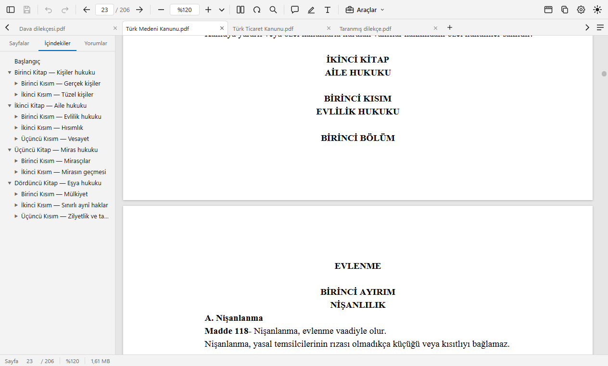
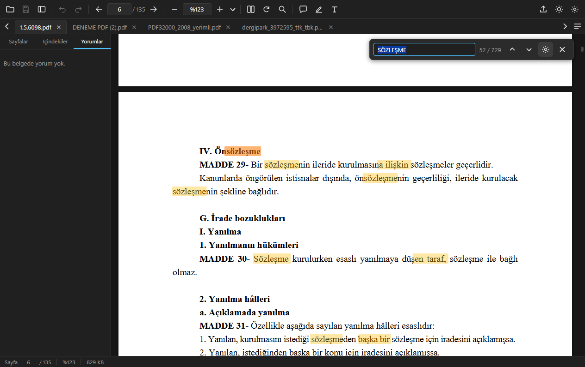
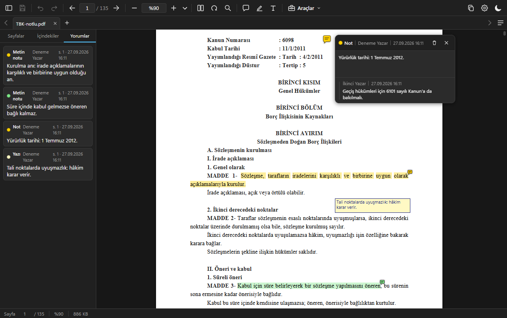

# PDEfe

### [⬇ PDEfe-Setup.exe indir](https://github.com/SCgrS/PDEfe/releases/latest/download/PDEfe-Setup.exe)

Windows 11 (ve Windows 10) için Türkçe, sekmeli **PDF görüntüleyici ve düzenleyici**. Hukukçuların ve
her gün onlarca PDF açan herkesin işini görmek için yazıldı: belgeler sekmelerde açılır, metin kopyalandığında
satır sonları ve tireler temizlenir, arama Türkçe karakterleri doğru tanır, eklenen notlar başka PDF okuyucularında
ve UYAP'ta aynen görünür.

Geliştirici: [x.com/CgrShn](https://x.com/CgrShn)

## Ne yapar

- **Sekmeler.** Birden çok PDF tek pencerede; sekmeler aynı genişliktedir: az sekmede geniş, çoğaldıkça birlikte daralır, en dar
  hâlde ("ustyazi (85).pdf" gibi adlar yine tam görünür, uzun ad üç noktayla kısalır, tam ad ve yol ipucunda) sekme çubuğu kaydırılır.
  Sekme çubuğu hiç kapanmaz: belge yokken "Yeni sekme" (açılış sayfası) durur, açılan ilk belge onun yerini alır; belge yokken de
  **+** ile yeni boş sekmeler açılabilir. Sekmeler sürüklenerek
  sıralanır (sürüklenen sekme imleci izler, komşusunun dörtte birine girince komşusu kayarak yer açar; `Esc` vazgeçer). Sekmede sağ
  tıkla kapatma, pencereye ayırma, klasörde gösterme, yolu ve PDF'in kendisini kopyalama. `Ctrl+Tab` basılı tutulunca
  son kullanılan sırayla sekme seçici açılır; `Ctrl+PageUp` / `Ctrl+PageDown` ya da `Ctrl+←` / `Ctrl+→` önceki / sonraki
  sekmeye, `Ctrl+1` – `Ctrl+9` doğrudan sekmeye gider. Sekme çubuğundaki **+** (ya da `Ctrl+T`) açılış sayfasını yeni bir
  sekmede açar; oradan açılan belge o sekmenin yerine açılır. Bir belge yeniden
  açıldığında kalınan sayfadan devam edilir (Ayarlar › Açılış ve düzen'den kapatılabilir). Sekme çubuğundaki ◀ ▶ ilk ve
  son sekmede durur. Pencere kapatılırken değişikliği olmayan sekmeler hemen kapanır; kaydedilmemiş değişikliği olan her
  belge için "Çıkmadan önce kaydetmek ister misiniz?" sorulur (Kaydet / Kaydetme / Vazgeç; Vazgeç'te o belgeler açık kalır).
  Açık bir araç penceresinde kaydedilmemiş iş varsa önce onun sorusu gelir.
- **Pencereler.** Sekme kendi penceresine ayrılır: sekmeyi sekme çubuğunun dışına sürükleyip bırakın (belgenin adı ve küçük
  görüntüsü imleci izler; bırakılan yerde, öteki ekranda da, yeni pencere açılır) ya da sekmede sağ tık › **Pencereye ayır**.
  Ayrılan sekme başka bir PDEfe penceresinin sekme çubuğuna bırakılınca o pencereye takılır (gireceği yer çizgiyle gösterilir);
  çubuğa geri getirilirse yerine döner, `Esc` vazgeçer. Kaydedilmemiş notlar, sayfa değişiklikleri ve geri al / yinele geçmişi
  sekmeyle birlikte taşınır; belge aynı sayfada açılır. Her pencere kendi araç çubuğu, sekmeleri ve sol paneliyle çalışır;
  ayarlar ortaktır. Bir belge aynı anda tek pencerede açık olur: başka pencerede açık belge yeniden açılmak istenince o pencere
  öne gelir; Gezgin'de çift tıklanan PDF en son kullanılan pencerede açılır. Pencere kapatılırken yalnızca o pencerenin
  kaydedilmemiş belgeleri sorulur; **Dosya › Çıkış** bütün pencereleri sırayla kapatır, `Alt+F4` yalnızca etkin pencereyi.
- **Keskin görüntü.** Düz ve kalın yazılar Windows'un ClearType çizimiyle keskin çizilir; kalın yazılar fazla koyulaşmaz
  (Windows'un bazı kalın yazı tiplerini küçük boyutta fazla koyu çizmesi ölçülüp düzeltilir); döndürülmüş sayfada harfler
  bozulmaz. Gömülü olmayan Times, Arial ve Courier yazıları Windows'un Times New Roman, Arial ve Courier New yazı tipleriyle
  çizilir (Ayarlar › Görünüm › Yazı çizimi: "Dengeli" ya da "Windows ClearType"). Görseller, karekodlar ve tablo
  çizgileri keskin çizilir; taranmış belgeler çok yakınlaştırıldığında da net ve hızlıdır.
- **Temiz kopyalama.** Seçilen metin panoya yapıştırıldığında paragrafın satırları birleştirilir (her satırı ayrı
  yazılmış mevzuat PDF'lerinde de), satır sonlarındaki tireler birleştirilir, girintiler korunur, paragraflar tek satır
  sonuyla ayrılır (UYAP Doküman Editörü'nde ve Word'de paragraf aralarına fazladan boş paragraf girmez; girintili
  paragrafa yapıştırınca satırlar dağılmaz), bozuk glifler düzeltilir. Belgede gerçekten boş satır olan yerler (kanunlarda
  bölüm ve madde başlıklarından önceki boşluk, sayfa sonuna denk gelenler dahil) bir boş paragraf olarak gelir; paragraf
  aralığı boş satır sayılmaz.
- **Taranmış belgede seçim.** Taranmış sayfalardaki ve sayfaya resim olarak konmuş yazılar (kaşe, antet) PDF'in kendi metni gibi
  fareyle seçilir ve temiz kopyalanır. Yazıyı Windows'un yerleşik yazı tanıyıcısı (Türkçe dil paketi) okur: çevrim dışı, belge
  bir yere gönderilmez, dosyaya bir şey yazılmaz. Sayfada zaten seçilebilen metin varsa (başka programla tanınmış tarama) o metin
  kullanılır; tanınan yazı `Ctrl+F` aramasına girmez.
- **Türkçe arama.** `Ctrl+F` ile bul: İ/ı ve I/ı ayrımı doğru, tam sözcük seçeneği, yer imlerinde ve
  yorumlarda arama, tüm açık sekmelerde arama. Açık belgeler listesindeki **Tüm belgelerde ara** kutusu her
  belgedeki eşleşme sayısını gösterir. Word 2010'un bozuk Türkçe kodlaması (Ġ→İ, ġ→Ş, Ģ→ş) hem
  görünen metinde hem aramada düzeltilir.
- **Standart PDF notları.** Vurgu (yazının rengi değişmez; varsayılan renk PDF okuyucularında yaygın olan sarı; metin seçince
  çıkan çubukta tek tıkla varsayılan renkle vurgulama, ▾ ile başka renk: seçilen renk değiştirilene dek varsayılan olur; vurguya
  tıklayınca açılan çubuktan renk değiştirme, not ekleme ve kaldırma), seçili metne not
  ("Metinle ilgili yorum" türünde notlu vurgu; üzerine gelince tıklamadan görünür), not ve serbest
  yazı ekleme; taşıma, düzenleme, silme. Nota yanıt yazılmaz; başka programlarda yazılmış yanıtlar salt okunur gösterilir.
  Yazılarda seçili sözcükler kalın, italik ya da altı çizili yapılır; yazılar Türkçe karakterli Windows fontuyla
  (Segoe UI, Arial, Times, Calibri) belgeye gömülür, başka PDF okuyucularında ve UYAP'ta aynı görünür. Notlar `Ctrl+S` ile
  ya da istenirse kendiliğinden kaydedilir (Ayarlar › Kaydetme › Otomatik kaydet, varsayılan kapalı). Not ekleme artımlı
  kaydedilir, belgenin geri kalanına dokunulmaz; kayıtlı bir not silinir ya da değişirse belge baştan yazılır, notun eski hâli
  dosyada kalmaz (belgede PDF'e gömülü e-imza varsa imzayı korumak için sorulur).
- **Geri al / yinele.** Her not ve sayfa işlemi `Ctrl+Z` / `Ctrl+Y` ile geri alınır; kayıttan sonra bile.
- **Araçlar** (araç çubuğundaki **Araçlar** düğmesi, açılış ekranı ya da Araçlar menüsü; belge açık değilken önce PDF seçilir;
  pencerelerdeki fare ve tuş kullanımı `F1` Kısayollar'da): **PDF Sıkıştırma** (üç hazır seviye, boyut
  tahmini), **Sayfaları düzenle** (küçük resim ızgarasında sürükleyerek sıralama, boş alandan sürükleyerek çoklu seçim,
  silme, döndürme, boş sayfa ya da başka PDF'ten sayfa ekleme), **Döndür ve kaydet**, **PDF ayır** (sayfa aralıklarına göre
  ayrı ayrı dosya ya da tek dosya, her sayfa ayrı dosya), **Görüntü / PDF birleştir** (görüntü ve PDF'lerden tek PDF; bir PDF
  açıkken açılınca o PDF listenin başında gelir;
  sürükle-bırak, `Ctrl+V`, Panodan ekle ya da sağ tık Yapıştır; Orijinal / Yüksek / Orta / Düşük kalite düğmelerinde
  toplam tahmini boyut; görüntünün sayfası "Orijinal" (varsayılan: sayfa tam görsel boyutunda) ya da "A4'e sığdır"; farenin sağ
  tuşuyla sürükleyerek, `Ctrl` / `Shift` ile tıklayarak çoklu seçim, seçilenler birlikte döndürülür, taşınır, çıkarılır).
  Her araçta Kaydet bölümü aynı düzendedir: "Yeni belge olarak kaydet" (varsayılan; önerilen ad "Sıkıştırılmış", "Düzenlenmiş",
  "Döndürülmüş", "Ayrılmış", "Birleşik"; klasör Masaüstü, Ayarlar › Kaydetme'den değiştirilir) ya da "Üzerine yaz" (yedeksiz,
  güvenli yer değiştirme; yazılacak dosyanın adı ve klasörü soluk görünür): Sıkıştırma'da, Ayır'da ve Birleştir'de üzerine
  yazma geri alınamaz (uyarı gösterilir), Döndür'de ve Sayfaları düzenle'de `Ctrl+Z` ile geri alınır; Ayır'da yalnızca tek
  dosya üreten ayırmada, Birleştir'de araç açılırken açık olan PDF listedeyse kullanılabilir. Dosya adı uzantısız yazılır
  (".pdf" kaydederken eklenir; Ayır birden çok dosyada "Ayrılmış - Sayfa 1-3.pdf" gibi adlar verir); yanındaki klasöre tıklamak
  onu Gezgin'de açar. Uzun işlerde ilerleme çubuğu ve
  iptal. Açık bir pencerenin dışına (arkadaki karartılmış alana) tıklamak onu kapatır; kaydedilmemiş iş varsa sorulur.
- **Yazdır** (`Ctrl+P`): sayfa aralığı, kâğıt boyutu, sayfaya sığdırma; sayfalar görüntü olarak basıldığından
  Türkçe karakterler ekrandaki gibi çıkar. Notlar istenirse basılır ("Notları yazdır" varsayılan olarak kapalı).
- **PDF'i kopyala** (araç çubuğunun sağındaki kopyala simgeli düğme, Araçlar menüsü ya da sekmede sağ tık; yanında Ayarlar düğmesi).
  Belgeyi dosya olarak panoya kopyalar; UYAP'a, e-postaya ya da Gezgin'e `Ctrl+V` veya Yapıştır ile yapıştırılır.
- **Menü çubuğu** (Dosya, Düzen, Görünüm…) varsayılan olarak gizlidir; kopyala düğmesinin solundaki düğmeyle açılıp kapanır, seçim
  hatırlanır. Gizliyken `Alt` menü çubuğunu geçici gösterir; menünün kısayolları her iki durumda da çalışır.
- **Koyu mod.** Sistem temasını izler; istenirse sayfa da tam siyaha koyulaştırılır (görseller korunur; yazı kutuları
  sayfayla birlikte koyulaşır, dosyadaki renkleri değişmez).
- **Döndür.** Döndür düğmesi ve `Ctrl+R` / `Ctrl+Shift+R` (saat yönünde / tersine) belgeyi döndürür: geçerli sayfa ya da tüm PDF
  sorulur ("Seçeneğimi hatırla" ile bir daha sorulmaz; Ayarlar › Açılış ve düzen'den değiştirilir). Geri alınabilir;
  kaydedince dosyaya yazılır.
- Sayfa düzeni (tek sayfa / iki sayfa, kaydırma aç/kapa, kapak ayrı; bütün sekmelere uygulanır), %6400'e kadar
  yakınlaştırma (genişliğe sığdır, kaydırmalı düzende sayfaların çoğunun genişliğine göre: birkaç geniş sayfa belgeyi
  küçültmez, yana taşar), okuma modu, tam ekran, sol panelde küçük resimler / İçindekiler / Yorumlar, belge içi ve dış
  bağlantılar (dış bağlantı yalnızca web ve e-posta adresiyse, adresi gösterilip sorulduktan sonra açılır), form alanlarının görünümü, parola korumalı belgeler, sürükle-bırak.
- **Ayarlar** (`Ctrl+,` ya da araç çubuğundaki dişli): Görünüm (tema, yazı çizimi), Açılış ve düzen (varsayılan PDF
  görüntüleyici: PDEfe zaten varsayılansa "Zaten varsayılan"; kaldığım sayfa ve Hatırlanan sayfaları temizle, son açılanlar ve Listeyi temizle; yakınlaştırma,
  tek / iki sayfa, kaydırma, kapak, Döndür düğmesi), Not ve vurgu, Kaydetme (otomatik kaydet, araçların çıktı klasörü),
  Güncelleme. Kopyalama her zaman temiz metinle yapılır.
- **Açılış ekranı.** Belge açık değilken ve yeni sekmede: büyük **PDF aç** düğmesi (PDF'ler pencereye sürüklenerek de açılır),
  bütün araçlar ve altlarında son açılan en çok 10 belge (tek tıkla açılır; × ya da sağ tıkla listeden kaldırılır, klasörde
  gösterilir; kutu kaydırılmaz, geniş pencerede iki sütun). Uygulamanın adı ve sürümü sağ altta (tıklanınca Ayarlar ›
  Hakkında açılır). Belge gerektiren bir araç seçilince önce Aç penceresi gelir, araç seçilen PDF'le açılır. Liste istenirse
  hiç tutulmaz: Ayarlar › Açılış ve düzen › Son açılanları hatırla kapatılınca liste silinir, açılış ekranındaki kutu ve Dosya
  menüsündeki Son açılanlar kalkar.

## Ekran görüntüleri







## Kurulum

1. Yukarıdaki bağlantıdan `PDEfe-Setup.exe` dosyasını indirin (Windows 10/11, 64 bit; yönetici hakkı gerekmez).
2. Dosyaya **çift tıklayın**.
3. Dosya imzalı olmadığı için Windows SmartScreen uyarı gösterebilir: **Daha fazla bilgi** yazısına, sonra
   **Yine de çalıştır** düğmesine basın. Bu uyarı kod imzalama sertifikası olmadığından çıkar; her yeni
   sürümde tekrarlanabilir.
4. Sihirbaz Türkçedir: lisans, kurulum klasörü (varsayılan `%LOCALAPPDATA%\Programs\PDEfe`), **Ek görevler**
   sayfasında masaüstü kısayolu seçeneği. Başlat menüsüne **PDEfe** kısayolu eklenir ve `.pdf` dosyaları
   "Birlikte aç" menüsünde PDEfe ile görünür.
5. Son sayfada **PDEfe'yi başlat** ve **PDEfe'yi varsayılan PDF görüntüleyici yap** seçenekleri vardır.

### Varsayılan PDF görüntüleyici yapma

Windows 11'de varsayılan uygulamayı yalnızca kullanıcı seçebilir; kurulum bunu kendiliğinden değiştiremez.
İki yol:

- Kurulumun son sayfasında **PDEfe'yi varsayılan PDF görüntüleyici yap** kutusunu işaretleyin: Windows
  Ayarlar'ın **Varsayılan uygulamalar › PDEfe** sayfası açılır; `.pdf` satırında **PDEfe**'yi seçin.
- Daha sonra: **Ayarlar › Uygulamalar › Varsayılan uygulamalar › PDEfe** ya da PDEfe içinde
  **Ayarlar › Açılış ve düzen › Varsayılan PDF görüntüleyici yap** (PDEfe zaten varsayılansa orada yeşil tik ve "Zaten varsayılan" görünür). Bir `.pdf` dosyasına sağ tıklayıp **Birlikte aç › Başka bir
  uygulama seç › PDEfe › Her zaman** de olur.

### Güncelleme

PDEfe haftada bir (son denetimden bu yana bir hafta geçtiyse açılışta; günlerce açık kalıyorsa gün içinde) GitHub'dan
yeni sürüm olup olmadığına bakar. Yeni sürüm varsa pencerenin üstünde **PDEfe X hazır (kullandığınız: Y).** şeridi çıkar.
**Güncelle** düğmesine bir kez basmak yeter: paket indirilir (yalnızca değişen kısımlar), kurulum sihirbazı açılmadan
kurulur ve PDEfe kendiliğinden yeni sürümle açılır. Kaydedilmemiş belge varsa önce sorulur; ayarlarınıza dokunulmaz.
**Daha sonra** şeridi o oturum için gizler. İstediğiniz an **Yardım › Güncellemeleri denetle** ya da
**Ayarlar › Güncelleme › Şimdi denetle** ile hemen bakabilirsiniz; otomatik denetim aynı yerden kapatılır.

Sürüm notları: [CHANGELOG.md](CHANGELOG.md) ve [Sürümler sayfası](https://github.com/SCgrS/PDEfe/releases).

### Kaldırma

**Ayarlar › Uygulamalar › Yüklü uygulamalar › PDEfe › Kaldır**. Ayarlarınız (`%APPDATA%\PDEfe\ayarlar.json`)
silinmez; isterseniz o klasörü elle silebilirsiniz. Kurulum sistem klasörlerine ve HKLM'ye yazmaz.

## Klavye kısayolları

| Kısayol | İşlev |
| --- | --- |
| `Ctrl+O` | PDF aç |
| `Ctrl+T` | Yeni sekme (açılış sayfası) |
| `Ctrl+S` / `Ctrl+Shift+S` | Kaydet / Farklı kaydet |
| `Ctrl+W` | Sekmeyi kapat |
| `Ctrl+P` | Yazdır |
| `Ctrl+F` | Bul |
| `F3` / `Shift+F3` | Sonraki / önceki eşleşme |
| `Ctrl+G` | Sayfaya git |
| `Ctrl+,` | Ayarlar |
| `Ctrl+Z` / `Ctrl+Y` | Geri al / yinele |
| `Ctrl+PageUp` / `Ctrl+PageDown`, `Ctrl+←` / `Ctrl+→` | Önceki / sonraki sekme |
| `Ctrl+Tab` / `Ctrl+Shift+Tab` | Son kullanılan sekmeler arasında geç (basılı tutunca seçici açılır; seçicide `←` `→`) |
| `Ctrl+1` – `Ctrl+9` | Sekme seç (`9`: son sekme) |
| `Ctrl+fare tekerleği`, `Ctrl++` / `Ctrl+−` | Yakınlaştır / uzaklaştır (Türkçe klavyede `+` Shift+4 ya da sayısal tuş takımındaki +) |
| `Ctrl+0` | Gerçek boyut |
| `Ctrl+R` / `Ctrl+Shift+R` | Belgeyi saat yönünde / tersine döndür (geçerli sayfa ya da tüm PDF; geri alınabilir) |
| `F4` | Sol panel |
| `Alt` | Gizli menü çubuğunu geçici göster |
| `Ctrl+H` | Okuma modu |
| `F11` | Tam ekran |
| `←` `→`, `PageUp` `PageDown` | Önceki / sonraki sayfa |
| `Home` / `End` | İlk / son sayfa |
| `Ctrl+Home` / `Ctrl+End` | Belge başı / sonu |
| `Ctrl+B` / `Ctrl+I` / `Ctrl+U` | Yazı kutusunda seçili metni kalın / italik / altı çizili yap |
| `Delete` | Seçili notu sil |
| `Esc` | Kapat / vazgeç; yazı kutusunda düzenlemeyi bitirir (yazılan korunur) |
| `F1` | Kısayollar (araç pencerelerindeki fare ve tuş kullanımı dahil) |

## Verileriniz

Bütün işlemler yereldir; belgeleriniz hiçbir yere gönderilmez, telemetri yoktur. Ağa yalnızca sürüm
denetiminde (`github.com`) çıkılır. Görsellerdeki yazıyı Windows'un kendi yazı tanıyıcısı bilgisayarda okur; tanınan yazı yalnızca
PDEfe açıkken bellekte tutulur, dosyaya ya da başka bir yere yazılmaz. Ayarlar `%APPDATA%\PDEfe\ayarlar.json` dosyasındadır. Son açılan belgelerin listesi
ve belgelerde kalınan sayfalar da (dosya yollarıyla) bu dosyada tutulur; ikisi de Ayarlar › Açılış ve düzen'den kapatılır,
kapatılınca kayıtları silinir (kalınan sayfalar Hatırlanan sayfaları temizle ile de silinir). Yapıştırılan ekran görüntüleri
ve yazdırılan sayfaların görüntüleri `%TEMP%\PDEfe` altında geçici tutulur; PDEfe açılırken ve kapanırken silinir. Notlara
yazılan yazar adı Ayarlar › Not ve vurgu › Yazar adı'ndadır (varsayılanı Windows kullanıcı adı) ve kaydedilen notla
birlikte PDF'e yazılır.

## Geliştirme

Gereksinimler: Node.js 22, Python 3.12 (proje içi `.venv`), Git. Windows'ta geliştirilir ve paketlenir.

```bash
git clone https://github.com/SCgrS/PDEfe.git
cd PDEfe
npm install

# Python çekirdeği için sanal ortam (uv ile; pip de olur)
uv venv .venv --python 3.12
uv pip install --python .venv/Scripts/python.exe pymupdf fonttools pillow pyinstaller
# görsellerdeki yazının tanınması (Windows yazı tanıyıcısının Python bağları)
uv pip install --python .venv/Scripts/python.exe winrt-runtime winrt-Windows.Foundation winrt-Windows.Foundation.Collections \
  winrt-Windows.Globalization winrt-Windows.Graphics.Imaging winrt-Windows.Media.Ocr winrt-Windows.Storage.Streams

npm start                 # geliştirme: Electron + core/pdefe_core.py (.venv ile)
npm run cekirdek:derle    # PyInstaller → core/dist/pdefe-core/ (tek klasör)
npm run dist              # electron-builder → release/PDEfe-Setup.exe
```

- Arayüz `src/renderer` altında derleme adımı olmayan ES modülleridir; ana süreç `src/main` (Node ESM).
- `core/pdefe_core.py` PyMuPDF tabanlı yardımcı süreçtir; ana süreçle stdio üzerinden satır başına bir JSON
  (JSON-RPC benzeri) konuşur. Uzun işler `progress` mesajları gönderir.
- Paketleme yapılandırması `electron-builder.yml`, kurulum sihirbazı eklemeleri `build/installer.nsh`.
- Sürüm çıkarma: `package.json` sürümünü yükselt, `CHANGELOG.md`'ye bölüm ekle, `git tag vX.Y.Z` ve push;
  `.github/workflows/yayim.yml` paketi derleyip GitHub Releases'e yükler (`PDEfe-Setup.exe`, `.blockmap`, `latest.yml`).
- Mimari ve kararlar: [PLAN.md](PLAN.md).

## Üçüncü taraf projeler

PDEfe şu açık kaynak projelerin üzerine kuruludur (sürümler ve lisanslar için [THIRD_PARTY.md](THIRD_PARTY.md)):

- **Electron** (MIT) — Chromium (BSD) ve Node.js (MIT) ile birlikte uygulama çatısı.
- **PDF.js / pdfjs-dist** (Apache-2.0, Mozilla) — sayfa çizimi, metin katmanı, yer imleri.
- **PyMuPDF** ve **MuPDF** (AGPL-3.0, Artifex) — belge işleme çekirdeği: notlar, kaydetme, küçük resimler.
- **Python** (PSF), **fontTools** (MIT), **Pillow** (MIT-CMU), **PyInstaller** (GPL-2.0, önyükleyici istisnası).
- **pywinrt** (MIT) — Windows'un yerleşik yazı tanıyıcısına (Windows.Media.Ocr) Python'dan erişim.
- **electron-builder / electron-updater** (MIT), **electron-store** (MIT), **pdf-lib** (MIT), **NSIS** (zlib).

<!-- TEŞEKKÜR: kullanıcı onayı bekliyor — aşağıdaki bölüm proje sahibi onaylayınca yayımlanacak.
## Teşekkür

Bu uygulama, yukarıdaki projelerin geliştiricilerinin emeği üzerine kuruludur; her biri kendi lisansıyla
kullanıldı. Özellikle Mozilla'nın PDF.js ekibine ve Artifex'in MuPDF ekibine teşekkürler.
-->

## Lisans

PDEfe, **GNU Affero General Public License v3.0 (AGPL-3.0)** ile dağıtılır; tam metin [LICENSE](LICENSE)
dosyasındadır. PDF motoru olarak kullanılan MuPDF ve PyMuPDF AGPL-3.0 lisanslı olduğundan PDEfe de aynı
lisansı taşır: yazılımı kullanabilir, değiştirebilir ve dağıtabilirsiniz; değiştirilmiş sürümleri
dağıtırken (ağ üzerinden sunmak dahil) kaynak kodunu aynı lisansla açmanız gerekir.
