# PDEfe

### [⬇ Windows için indir (PDEfe-Setup.exe)](https://github.com/SCgrS/PDEfe/releases/latest/download/PDEfe-Setup.exe)
### [⬇ macOS için indir (PDEfe-Mac.dmg)](https://github.com/SCgrS/PDEfe/releases/latest/download/PDEfe-Mac.dmg)

Windows 11 (ve Windows 10) ile macOS (13 Ventura ve sonrası; Apple işlemcili ve Intel Mac'ler) için Türkçe, sekmeli **PDF görüntüleyici
ve düzenleyici**. Hukukçuların ve her gün onlarca PDF açan herkesin işini görmek için yazıldı: belgeler sekmelerde açılır, metin
kopyalandığında satır sonları ve tireler temizlenir, arama Türkçe karakterleri doğru tanır, eklenen notlar başka PDF okuyucularında ve
UYAP'ta aynen görünür.

Geliştirici: [x.com/CgrShn](https://x.com/CgrShn)


## Öne çıkanlar

- **Sekmeler ve pencereler:** birden çok PDF tek pencerede; sekme sürüklenerek kendi penceresine ayrılır.
- **Temiz kopyalama:** satırlar paragraf olarak birleşir, tireler kalkar; UYAP Doküman Editörü'ne ve Word'e düzgün yapışır.
- **Taranmış belgede seçim:** taranmış sayfadaki yazı da fareyle seçilip kopyalanır (bilgisayarın kendi yazı tanıyıcısıyla, çevrim dışı).
- **Türkçe arama:** İ/ı ayrımı doğru; bütün açık belgelerde birden arama.
- **Standart PDF notları:** vurgu, not, yazı; başka PDF okuyucularında ve UYAP'ta aynı görünür, e-imzayı bozmaz.
- **Araçlar:** Sıkıştır, Sayfaları düzenle, Döndür, Ayır, Görüntü / PDF birleştir.
- **Windows ve macOS:** aynı uygulama, iki platformun kendi kısayollarıyla.

## Ne yapar

Kısayollar aşağıda Windows'a göre yazıldı; macOS'ta `Ctrl` yerine `⌘` kullanılır, Mac'te başka tuşa oturanlar
[Klavye kısayolları](#klavye-kısayolları) tablosundadır. Ekran görüntüleri Windows'ta alındı; macOS'ta görünüm aynıdır.

### Açılış ekranı

Belge açık değilken ve yeni sekmede: büyük **PDF aç** düğmesi (PDF'ler pencereye sürüklenerek de açılır), bütün araçlar ve altlarında
son açılan en çok 10 belge (tek tıkla açılır; × ya da sağ tıkla listeden kaldırılır, klasörde gösterilir; kutu kaydırılmaz, geniş
pencerede iki sütun). Uygulamanın adı ve sürümü sağ altta (tıklanınca Ayarlar › Hakkında açılır). Belge gerektiren bir araç seçilince
önce Aç penceresi gelir, araç seçilen PDF'le açılır. Liste istenirse hiç tutulmaz: Ayarlar › Açılış ve düzen › Son açılanları hatırla
kapatılınca liste silinir, açılış ekranındaki kutu ve Dosya menüsündeki Son açılanlar kalkar.

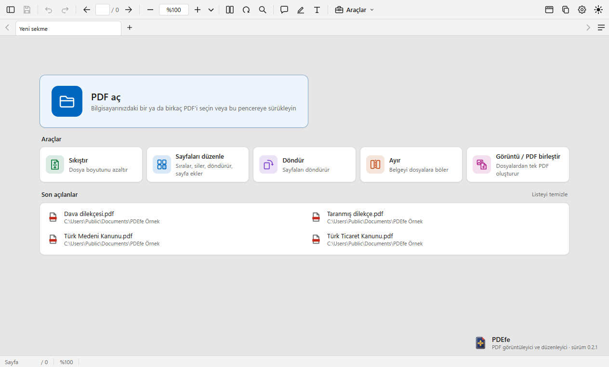

### Sekmeler ve pencereler

- **Sekmeler.** Birden çok PDF tek pencerede; sekmeler aynı genişliktedir: az sekmede geniş, çoğaldıkça birlikte daralır, en dar
  hâlde ("ustyazi (85).pdf" gibi adlar yine tam görünür, uzun ad üç noktayla kısalır, tam ad ve yol ipucunda) sekme çubuğu kaydırılır.
  Sekme çubuğu hiç kapanmaz: belge yokken "Yeni sekme" (açılış sayfası) durur, açılan ilk belge onun yerini alır; belge yokken de
  **+** ile yeni boş sekmeler açılabilir. Kaydedilmemiş değişikliği olan sekmenin adının önünde nokta (•) durur. Sekmeler sürüklenerek
  sıralanır (sürüklenen sekme imleci izler, komşusunun dörtte birine girince komşusu kayarak yer açar; `Esc` vazgeçer); orta tık sekmeyi
  kapatır, sekme çubuğunun üstünde fare tekerleği sekme değiştirir. `Ctrl+Tab` basılı tutulunca son kullanılan sırayla sekme seçici
  açılır (arka planda açılıp hiç bakılmamış sekmeler sonda); `Ctrl+PageUp` / `Ctrl+PageDown` ya da `Ctrl+←` / `Ctrl+→` önceki /
  sonraki sekmeye, `Ctrl+1` – `Ctrl+9` doğrudan sekmeye gider. Sekme çubuğundaki **+** (ya da `Ctrl+T`) açılış sayfasını yeni bir
  sekmede açar; oradan açılan belge o sekmenin yerine açılır. Bir belge yeniden açıldığında kalınan sayfadan devam edilir (Ayarlar ›
  Açılış ve düzen'den kapatılabilir). Sekme çubuğundaki ◀ ▶ ilk ve son sekmede durur.
- **Sekmede sağ tık:** Kapat, Diğerlerini kapat, Sağdakileri kapat, **Kaydet** (sağ tıklanan sekmenin belgesini o sekmeye geçmeden
  kaydeder; kaydederken bir şey sorulacaksa önce belge öne gelir; kaydedilecek değişiklik yokken soluk), Pencereye ayır, Klasörde
  göster, Yolu kopyala, PDF'i kopyala.
- **Kapatma.** Pencere kapatılırken değişikliği olmayan sekmeler hemen kapanır; kaydedilmemiş değişikliği olan her belge için "Çıkmadan
  önce kaydetmek ister misiniz?" sorulur (Kaydet / Kaydetme / Vazgeç; Vazgeç'te o belgeler açık kalır). Açık bir araç penceresinde
  kaydedilmemiş iş varsa önce onun sorusu gelir. Windows oturumu kapatılırken ya da bilgisayar yeniden başlatılırken de kaydedilmemiş
  belge varsa Windows bekletilir ve aynı soru sorulur.
- **Pencereler.** Sekme kendi penceresine ayrılır: sekmeyi sekme çubuğunun dışına sürükleyip bırakın (belgenin adı ve küçük görüntüsü
  imleci izler; bırakılan yerde, öteki ekranda da, yeni pencere açılır) ya da sekmede sağ tık › **Pencereye ayır**. Ayrılan sekme başka
  bir PDEfe penceresinin sekme çubuğuna bırakılınca o pencereye takılır (gireceği yer çizgiyle gösterilir); çubuğa geri getirilirse
  yerine döner, `Esc` vazgeçer. Kaydedilmemiş notlar, sayfa değişiklikleri ve geri al / yinele geçmişi sekmeyle birlikte taşınır; belge
  aynı sayfada açılır. Her pencere kendi araç çubuğu, sekmeleri ve sol paneliyle çalışır; ayarlar ortaktır. Bir belge aynı anda tek
  pencerede açık olur: başka pencerede açık belge yeniden açılmak istenince o pencere öne gelir; Gezgin'de (macOS'ta Finder'da) çift
  tıklanan ya da Dock simgesine bırakılan PDF en son kullanılan pencerede açılır. Pencere kapatılırken yalnızca o pencerenin kaydedilmemiş
  belgeleri sorulur; **Dosya › Çıkış** (macOS'ta **PDEfe › PDEfe'den çık**, `⌘Q`, ya da Dock › Çık) bütün pencereleri sırayla kapatır,
  `Alt+F4` yalnızca etkin pencereyi. PDEfe son kullanılan pencerenin yerinde açılır; o ekran artık bağlı değilse (ikinci ekran
  çıkarıldıysa) pencere görünen bir ekrana alınır.

### Görünüm

- **Keskin görüntü.** Düz ve kalın yazılar Windows'un ClearType çizimiyle keskin çizilir; kalın yazılar fazla koyulaşmaz (Windows'un
  bazı kalın yazı tiplerini küçük boyutta fazla koyu çizmesi ölçülüp düzeltilir); döndürülmüş sayfada harfler bozulmaz. Gömülü olmayan
  Times, Helvetica (Arial) ve Courier yazıları Windows'un Times New Roman, Arial ve Courier New yazı tipleriyle çizilir (Ayarlar ›
  Görünüm › Yazı çizimi: "Dengeli" ya da "Windows ClearType"). Görseller, karekodlar ve tablo çizgileri keskin çizilir; taranmış
  belgeler çok yakınlaştırıldığında da net ve hızlıdır. macOS'ta yazılar macOS'un kendi çizimiyle, gömülü olmayan standart yazılar
  Mac'teki Times New Roman, Arial ve Courier New'le çizilir.
- **Sayfa düzeni ve yakınlaştırma.** Tek sayfa / iki sayfa, kaydırma aç / kapa, iki sayfalı görünümde kapak ayrı (bütün sekmelere
  uygulanır). %25 ile %6400 arası yakınlaştırma: araç çubuğundaki kutuya yüzde yazılır; ▾ menüsünde gerçek boyut, sayfayı / genişliğe /
  görünür alana sığdır ve hazır yüzdeler. Genişliğe sığdır, kaydırmalı düzende sayfaların çoğunun genişliğine göredir: birkaç geniş
  sayfa belgeyi küçültmez, yana taşar.
- **Okuma modu ve tam ekran.** `Ctrl+H` okuma modu: araç, sekme ve durum çubukları gizlenir; fare pencerenin üst kenarına gelince araç
  çubuğu görünür; `Ctrl+H` ya da `Esc` ile çıkılır. `F11` tam ekran. Sol panelde (`F4`) küçük resimler, İçindekiler (yer imleri) ve
  Yorumlar.
- **Durum çubuğu.** Altta sayfa numarası (yazıp `Enter` ile o sayfaya gidilir), yakınlaştırma, dosya boyutu ve kaydedilmemiş değişiklik
  işareti.
- **Koyu mod.** Varsayılan olarak sistem temasını izler (Ayarlar › Görünüm › Tema: Açık / Koyu / Sistemi izle); araç çubuğunun
  sağındaki ay / güneş düğmesi ya da Görünüm › Koyu / açık tema ile hemen değişir. **Sayfayı da koyulaştır** açıksa sayfa da tam siyaha
  koyulaştırılır (görseller korunur; yazı kutuları sayfayla birlikte koyulaşır, dosyadaki renkleri değişmez; yazdırma ve kaydetme
  etkilenmez).
- **Menü çubuğu** (Windows; Dosya, Düzen, Görünüm…) varsayılan olarak gizlidir; kopyala düğmesinin solundaki düğmeyle açılıp kapanır,
  seçim hatırlanır. Gizliyken `Alt` menü çubuğunu geçici gösterir; menünün kısayolları her iki durumda da çalışır. macOS'ta menü her
  zaman ekranın üstündedir; bu düğme yoktur.

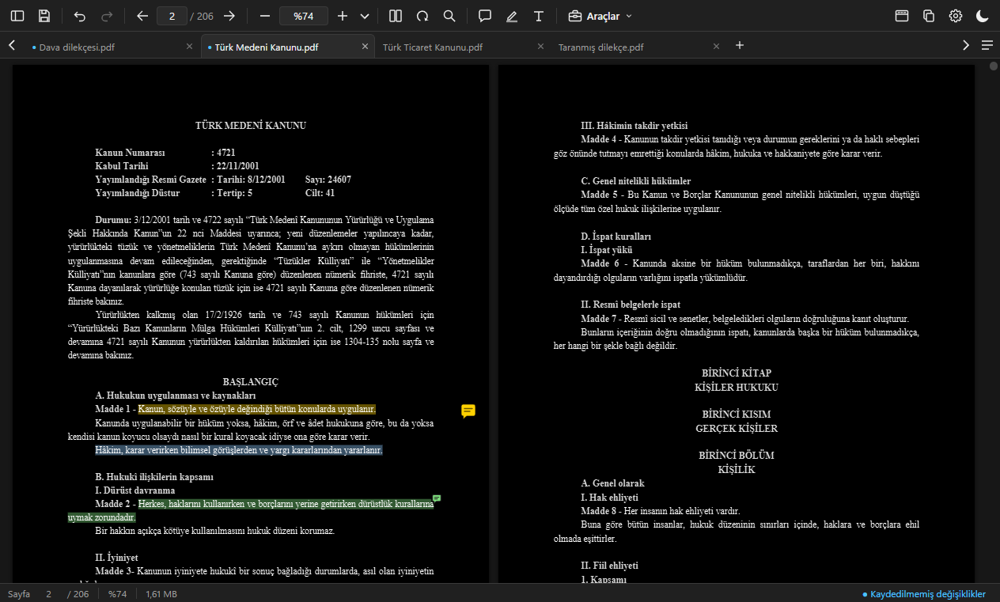

### Metin seçme ve temiz kopyalama

- **Seçme.** Metin sayfanın boş yerinden başlayarak da sürüklenerek seçilir; üç tık paragrafı, `Ctrl+A` geçerli sayfanın bütün metnini
  seçer. Seçimin yanında çıkan çubukta vurgula (▾ ile renk), not ekle ve kopyala düğmeleri vardır; metin seçiliyken `Ctrl+F` aramayı
  seçili metinle açar.
- **Sayfada sağ tık:** Kopyala, Vurgula, Not ekle (seçim yoksa tıklanan yere not), Ara (seçili metni Bul'da arar), Tümünü seç ve en
  altta **Kaydet**. Kaydet, kaydedilmemiş değişiklik (not, vurgu, yazı, sayfa düzeni) yokken soluk görünür; yazı kutusuna yazarken de
  seçilebilir (yazı not olarak kaydedilir).
- **Temiz kopyalama.** Seçilen metin panoya yapıştırıldığında paragrafın satırları birleştirilir (her satırı ayrı yazılmış mevzuat
  PDF'lerinde de; seçim satırın ortasından başlasa da), satır sonlarındaki tireler birleştirilir ("hâ- / kim" → "hâkim"; tarih ve sayı
  aralıklarında tire korunur), girintiler korunur, paragraflar tek satır sonuyla ayrılır (UYAP Doküman Editörü'nde ve Word'de paragraf
  aralarına fazladan boş paragraf girmez; girintili paragrafa yapıştırınca satırlar dağılmaz), bozuk glifler düzeltilir. Belgede
  gerçekten boş satır olan yerler (kanunlarda bölüm ve madde başlıklarından önceki boşluk, sayfa sonuna denk gelenler dahil) bir boş
  paragraf olarak gelir; paragraf aralığı boş satır sayılmaz.

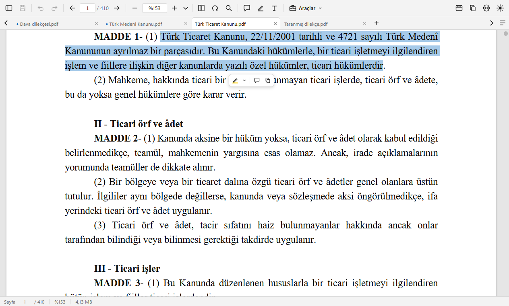

### Taranmış belgede seçim

Taranmış sayfalardaki ve sayfaya resim olarak konmuş yazılar (kaşe, antet) PDF'in kendi metni gibi fareyle seçilir ve temiz kopyalanır.
Yazıyı Windows'un yerleşik yazı tanıyıcısı (Türkçe dil paketi) okur: çevrim dışı, belge bir yere gönderilmez, dosyaya bir şey yazılmaz.
Bilgisayarda Türkçe tanıyıcı yoksa Windows'un dil listesindeki ilk tanıyıcı kullanılır (Türkçe harfler yanlış gelebilir); hiç tanıyıcı
yoksa görsellerdeki yazı seçilemez. macOS'ta Apple'ın yerleşik tanıyıcısı okur: macOS 26 ve sonrasında Türkçe; macOS 13–15'te Apple'ın
tanıyıcısı Türkçe bilmediğinden ş, ğ, ı, İ harfleri s, g, i, I gelebilir (ç, ö, ü, rakamlar ve tarihler doğru). Sayfada zaten seçilebilen
metin varsa (başka programla tanınmış tarama) o metin kullanılır; tanınan yazı `Ctrl+F` aramasına girmez.

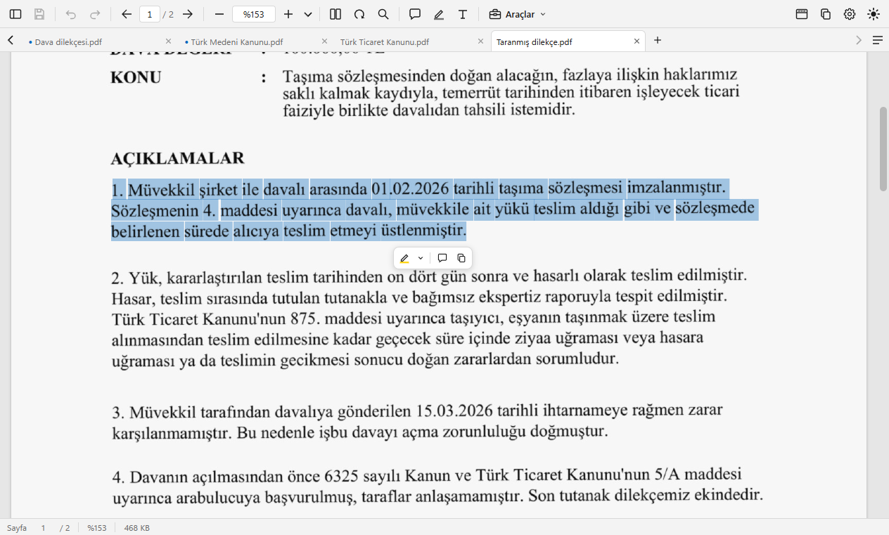

### Türkçe arama

`Ctrl+F` ile bul: İ/ı ve I/ı ayrımı doğru; Bul kutusunun dişli düğmesinde tam sözcük, büyük-küçük harf duyarlı, yer imlerini ve yorumları
dahil etme, geçerli belgede ya da tüm açık sekmelerde arama. `Enter` / `Shift+Enter` (ya da `F3` / `Shift+F3`) sonraki / önceki eşleşme.
Sekme çubuğunun sağındaki **Açık belgeler** (≡) listesinde **Tüm belgelerde ara** kutusu her belgedeki eşleşme sayısını gösterir;
satıra tıklayınca o belge ilk eşleşmesiyle açılır. Word 2010'un bozuk Türkçe kodlaması (Ġ→İ, ġ→Ş, Ģ→ş) hem kopyalanan metinde hem
aramada düzeltilir.

<p>
  
  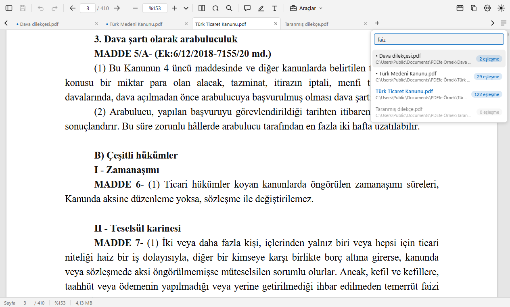
</p>

### Notlar

- **Standart PDF notları.** Vurgu (yazının rengi değişmez; varsayılan renk PDF okuyucularında yaygın olan sarı; altı hazır renk: sarı,
  kırmızı, turuncu, yeşil, mavi, pembe; metin seçince çıkan çubukta tek tıkla varsayılan renkle vurgulama, ▾ ile başka renk: seçilen
  renk değiştirilene dek varsayılan olur, araç çubuğundaki Vurgu düğmesine sağ tıklayınca da seçilir; vurguya tıklayınca açılan
  çubuktan renk değiştirme, not ekleme ve kaldırma), seçili metne not ("Metinle ilgili yorum" türünde notlu vurgu; üzerine gelince
  tıklamadan görünür), not ve serbest yazı ekleme; taşıma, düzenleme, silme. Nota yanıt yazılmaz; başka programlarda yazılmış yanıtlar
  salt okunur gösterilir. Yeni vurguların opaklığı ve yazı aracının yazı tipi, boyutu, rengi ve dolgusu Ayarlar › Not ve vurgu'dadır.
- **Yazı kutusu.** Düzenlenirken üstünde biçim çubuğu açılır: yazı tipi, boyut, yazı rengi, dolgu rengi (dolgusuz, hazır renkler ya da
  başka bir renk), kalın / italik / altı çizili (`Ctrl+B` / `Ctrl+I` / `Ctrl+U`; seçili sözcüklere), kenarlık; Tamam (ya da `Esc`,
  dışarı tıklama) yazıyı bırakır, Vazgeç değişikliği atar. Yazılar Türkçe karakterli Windows fontuyla (Segoe UI, Arial, Times, Calibri;
  macOS'ta Arial ve Times) belgeye gömülür, başka PDF okuyucularında ve UYAP'ta aynı görünür; oklar (→), matematik işaretleri (≤ ≠) ve
  Latin harfleri (ł, ő) de yazılır.
- **Kaydetme.** Notlar `Ctrl+S` ile ya da istenirse kendiliğinden kaydedilir (Ayarlar › Kaydetme › Otomatik kaydet, varsayılan kapalı).
  Not ekleme ve sayfa döndürme dosyanın sonuna eklenerek kaydedilir, belgenin geri kalanına dokunulmaz, PDF'e gömülü e-imza bozulmaz.
  Kayıtlı bir not silinir ya da değişirse belge baştan yazılır, notun eski hâli dosyada kalmaz (belgede e-imza varsa imzayı korumak için
  sorulur). Sayfa silmek, sıralamak ya da sayfa eklemek belgeyi baştan yazar; bu durumda e-imza geçersiz görünür.
- **Geri al / yinele.** Her not ve sayfa işlemi `Ctrl+Z` / `Ctrl+Y` ile geri alınır; kayıttan sonra bile.


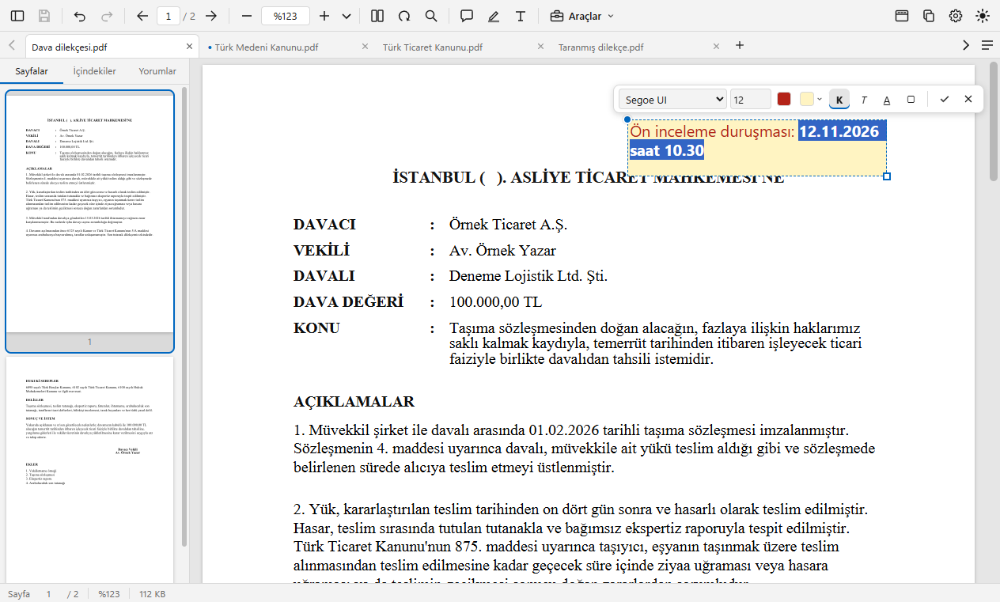

### Araçlar

Araç çubuğundaki **Araçlar** düğmesi, açılış ekranı ya da Araçlar menüsü; belge açık değilken önce PDF seçilir (Görüntü / PDF birleştir
hariç). Pencerelerdeki fare ve tuş kullanımı `F1` Kısayollar'dadır.

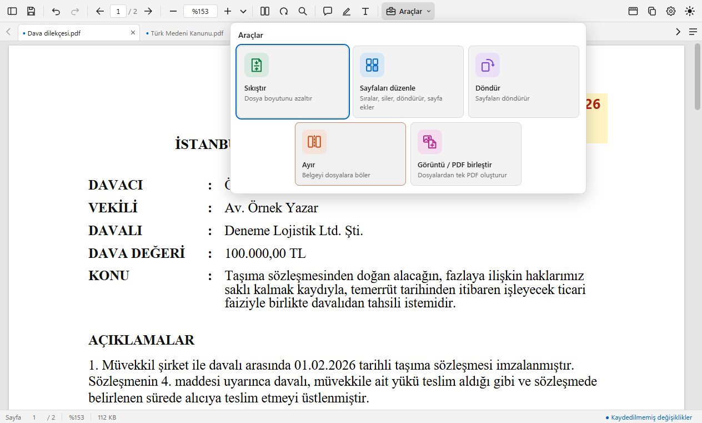

- **Sıkıştır:** Aşırı / İdeal / Düşük sıkıştırma, her birinde tahmini boyut; üzerine yazarken sonuç özgünden küçük değilse dosyaya
  dokunulmaz.
- **Sayfaları düzenle:** küçük resim ızgarasında sürükleyerek sıralama, boş alandan sürükleyerek çoklu seçim, silme, döndürme, boş sayfa
  ya da başka PDF'ten sayfa ekleme; pencere sekme şeridinin altında açılır.
- **Döndür:** tüm sayfalar, geçerli sayfa ya da bir aralık; 90° saat yönünde, tersine ya da 180°.
- **Ayır:** sayfa aralıklarına göre (örn. `1-3, 4-10, 11`; `-3` baştan 3. sayfaya, `8-` 8. sayfadan sona) ayrı ayrı dosya ya da tek
  dosya, ya da her sayfa ayrı dosya; oluşturulacak dosyalar adlarıyla önceden listelenir.
- **Görüntü / PDF birleştir:** PDF, JPG, PNG, BMP, GIF, TIFF ve WEBP dosyalarından tek PDF (HEIC fotoğraflarını önce JPG ya da PNG'ye
  çevirin). Bir PDF açıkken açılınca o PDF listenin başında gelir; pencere sekme şeridinin altında açılır, arkadaki sekmelerden doğru
  belgede olunduğu görülür. Dosya ekle, sürükle-bırak, `Ctrl+V`, Panodan ekle ya da sağ tık Yapıştır; Orijinal / Yüksek / Orta / Düşük
  kalite düğmelerinde toplam tahmini boyut; görüntünün sayfası "Orijinal" (varsayılan: sayfa tam görsel boyutunda) ya da "A4'e sığdır";
  farenin sağ tuşuyla sürükleyerek, `Ctrl` / `Shift` ile tıklayarak çoklu seçim, seçilenler birlikte döndürülür, taşınır, `Delete`
  (macOS'ta `⌫`) ile çıkarılır.

<p>
  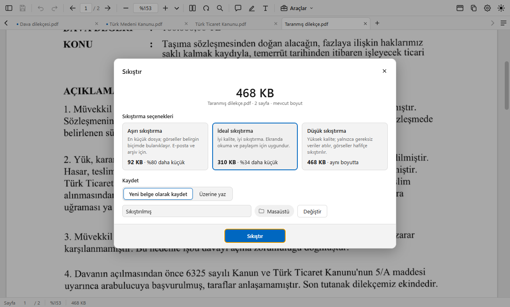
  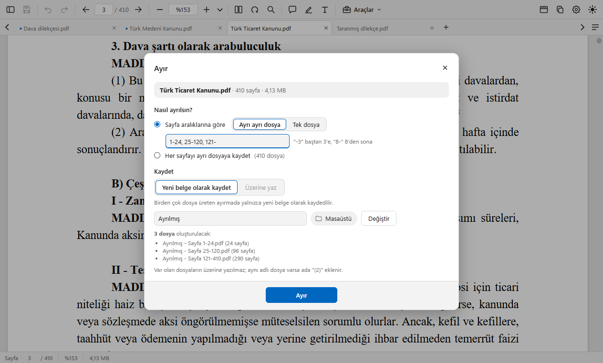
</p>

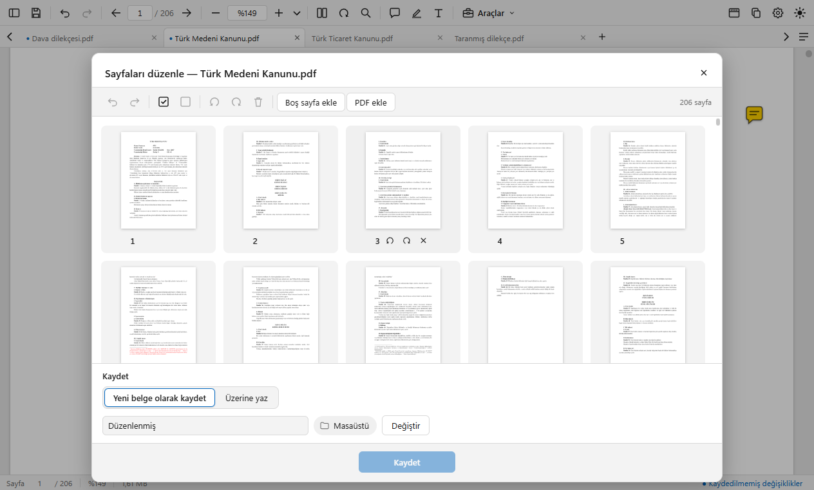

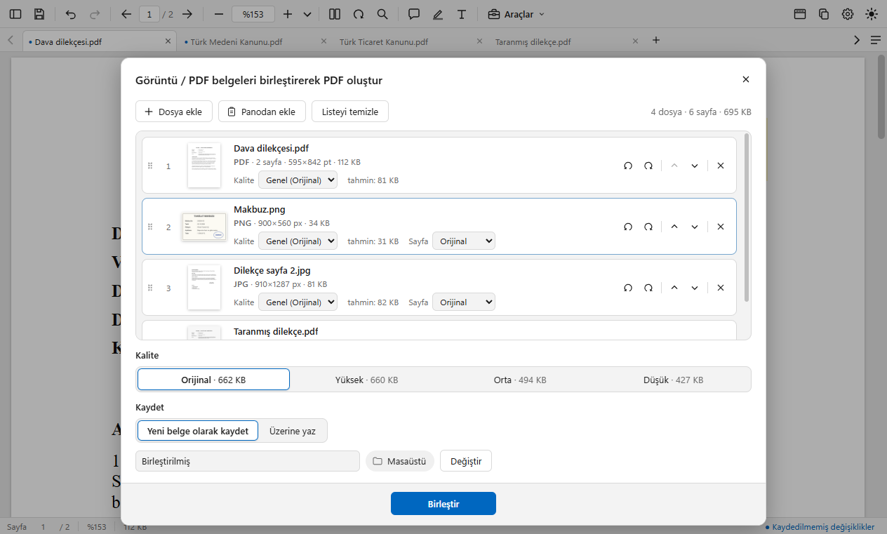

Her araçta Kaydet bölümü aynı düzendedir: "Yeni belge olarak kaydet" (varsayılan; önerilen ad "Sıkıştırılmış", "Düzenlenmiş",
"Döndürülmüş", "Ayrılmış", "Birleştirilmiş"; klasör Masaüstü, Ayarlar › Kaydetme'den değiştirilir) ya da "Üzerine yaz" (yedeksiz,
güvenli yer değiştirme; yazılacak dosyanın adı ve klasörü soluk görünür): Sıkıştır'da, Ayır'da ve Birleştir'de üzerine yazma geri
alınamaz (uyarı gösterilir), Döndür'de ve Sayfaları düzenle'de `Ctrl+Z` ile geri alınır; Ayır'da yalnızca tek dosya üreten ayırmada,
Birleştir'de araç açılırken açık olan PDF listedeyse kullanılabilir. Dosya adı uzantısız yazılır (".pdf" kaydederken eklenir; Ayır
birden çok dosyada "Ayrılmış - Sayfa 1-3.pdf" gibi adlar verir); yanındaki klasöre tıklamak onu Gezgin'de (macOS'ta Finder'da) açar.
Uzun işlerde ilerleme çubuğu ve iptal (kayıt sırasında iptal edilirse ve dosya yazılmışsa sonuç korunur, üzerine yazılması onaylanmış
dosya silinmez). Açık bir pencerenin dışına (arkadaki karartılmış alana) tıklamak onu kapatır; kaydedilmemiş iş varsa sorulur.

### Yazdırma ve PDF'i kopyala

- **Yazdır** (`Ctrl+P`): tüm sayfalar, geçerli sayfa ya da aralık; sayfaya sığdır ya da gerçek boyut; tek ya da çift taraflı (uzun /
  kısa kenardan çevir). Kâğıt boyutu belgenin sayfalarından kendiliğinden seçilir, yatay sayfalar döndürülerek basılır; yazıcı, kopya
  sayısı ve kâğıt kaynağı sonraki adımda Windows'un (macOS'un) yazdırma penceresinde seçilir. Sayfalar görüntü olarak basıldığından
  Türkçe karakterler ekrandaki gibi çıkar. "Notları yazdır" varsayılan olarak kapalıdır; kapalıyken notlar, damgalar ve form alanları
  basılmaz. Kaydedilmemiş değişiklik varsa önce kaydetmek isteyip istemediğiniz sorulur.
- **PDF'i kopyala** (araç çubuğunun sağındaki kopyala simgeli düğme, Araçlar menüsü ya da sekmede sağ tık; yanında Ayarlar düğmesi).
  Belgeyi dosya olarak panoya kopyalar; UYAP'a, e-postaya ya da Gezgin'e `Ctrl+V` veya Yapıştır ile yapıştırılır. Belgede kaydedilmemiş
  değişiklik varsa önce "Kaydet ve kopyala / Kaydetmeden kopyala" sorulur. macOS'ta dosya Finder'ın Kopyala'sı gibi panoya konur;
  Finder'a, Mail'e `⌘V` ile yapıştırılır.

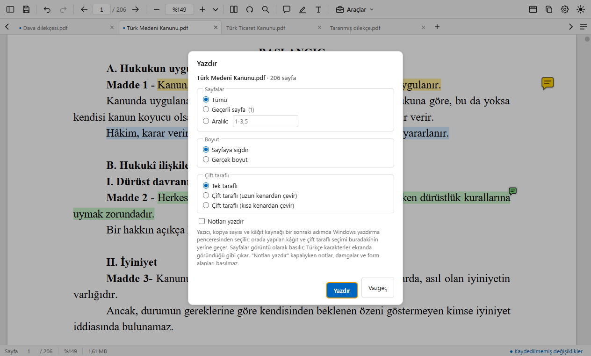

### Bağlantılar, formlar, parolalı belgeler

Belge içi bağlantılar sayfaya gider; dış bağlantı yalnızca web ve e-posta adresiyse, adresi gösterilip sorulduktan sonra açılır ("Bu
belgede yeniden sorma" seçilebilir). Form alanları görünür ama doldurulamaz. Parola korumalı belgeler parola sorularak açılır. PDF'ler
pencereye sürüklenerek açılır.

### Ayarlar

`Ctrl+,` (macOS'ta `⌘,` ya da PDEfe › Ayarlar…) ya da araç çubuğundaki dişli:

- **Görünüm:** tema, sayfayı da koyulaştır, yazı çizimi (macOS'ta "macOS çizimi").
- **Açılış ve düzen:** varsayılan PDF görüntüleyici (Windows'ta düğme; PDEfe zaten varsayılansa "Zaten varsayılan"; macOS'ta Finder ›
  Bilgi Al yolu anlatılır), kaldığım sayfa ve Hatırlanan sayfaları temizle, son açılanlar ve Listeyi temizle, yakınlaştırma, tek / iki
  sayfa, kaydırma, kapak.
- **Not ve vurgu:** yazar adı, vurgu rengi ve opaklığı, yazı aracının yazı tipi, boyutu, rengi ve dolgusu.
- **Kaydetme:** otomatik kaydet, araçların çıktı klasörü.
- **Güncelleme** ve **Hakkında** (sürüm, geliştirici; Yardım › PDEfe hakkında, macOS'ta PDEfe › PDEfe hakkında).

**Varsayılanlara dön** ayarları sıfırlar; son açılanlar, sayfa konumları ve pencere yerleşimi korunur. Kopyalama her zaman temiz metinle
yapılır.

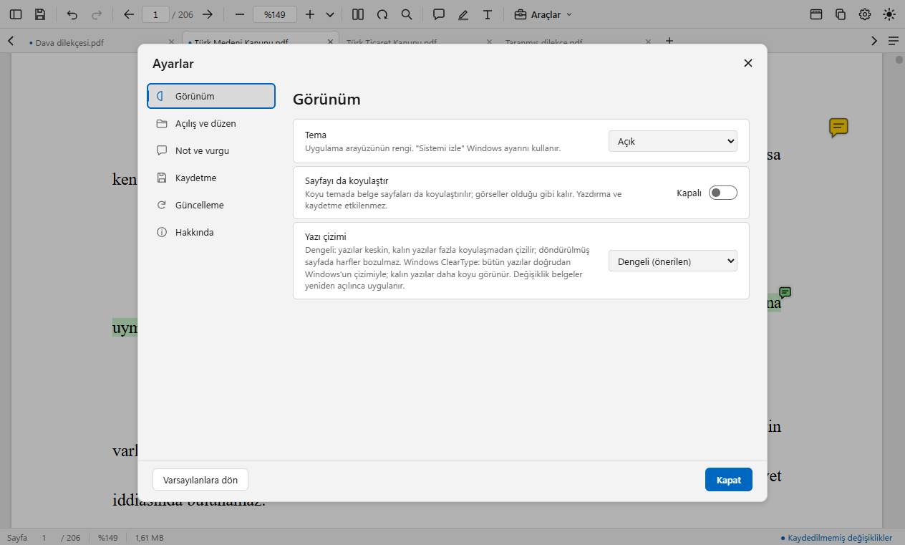

## Klavye kısayolları

| Windows | macOS | İşlev |
| --- | --- | --- |
| `Ctrl+O` | `⌘O` | PDF aç |
| `Ctrl+T` | `⌘T` | Yeni sekme (açılış sayfası) |
| `Ctrl+S` / `Ctrl+Shift+S` | `⌘S` / `⇧⌘S` | Kaydet / Farklı kaydet |
| `Ctrl+W` | `⌘W` | Sekmeyi kapat (pencerede yalnızca boş sekme varsa pencereyi kapatır) |
| Orta tık (sekmede) | Orta tık | Sekmeyi kapat |
| `Ctrl+P` | `⌘P` | Yazdır |
| `Ctrl+F` | `⌘F` | Bul |
| `F3` / `Shift+F3`, `Enter` / `Shift+Enter` (Bul kutusunda) | `⌘G` / `⇧⌘G`, `↩` / `⇧↩` | Sonraki / önceki eşleşme |
| `Ctrl+G` | `⌥⌘G` | Sayfaya git |
| `Ctrl+,` | `⌘,` | Ayarlar |
| `Ctrl+Z` / `Ctrl+Y` | `⌘Z` / `⇧⌘Z` | Geri al / yinele |
| `Ctrl+A` | `⌘A` | Geçerli sayfadaki bütün metni seç |
| `Ctrl+PageUp` / `Ctrl+PageDown`, `Ctrl+←` / `Ctrl+→` | `⇧⌘[` / `⇧⌘]`, `⌥⌘←` / `⌥⌘→` | Önceki / sonraki sekme |
| `Ctrl+Tab` / `Ctrl+Shift+Tab` | `⌃Tab` / `⌃⇧Tab` | Son kullanılan sekmeler arasında geç (basılı tutunca seçici açılır; seçicide `←` `→`) |
| `Ctrl+1` – `Ctrl+9` | `⌘1` – `⌘9` | Sekme seç (`9`: son sekme) |
| `Ctrl+fare tekerleği`, `Ctrl++` / `Ctrl+−` | `⌘+fare tekerleği`, dokunmatik yüzeyde kıstırma, `⌘+` / `⌘−` | Yakınlaştır / uzaklaştır (Türkçe klavyede `+` Shift+4 ya da sayısal tuş takımındaki +) |
| `Ctrl+0` | `⌘0` | Gerçek boyut |
| `Ctrl+R` / `Ctrl+Shift+R` | `⌘R` / `⇧⌘R` | Geçerli sayfayı saat yönünde / tersine döndür (geri alınabilir) |
| `F4` | `⌃⌘S` | Sol panel |
| `Alt` | — | Gizli menü çubuğunu geçici göster (macOS'ta menü ekranın üstünde hep görünür) |
| `Ctrl+H` | `⇧⌘H` | Okuma modu |
| `F11` | `⌃⌘F` | Tam ekran |
| `←` `→`, `PageUp` `PageDown` | `←` `→`, `fn+↑` `fn+↓` | Önceki / sonraki sayfa |
| `↑` `↓` | `↑` `↓` | Kaydır |
| `Boşluk` / `Shift+Boşluk` | `Boşluk` / `⇧Boşluk` | Bir ekran aşağı / yukarı |
| `Shift+fare tekerleği` | `⇧+fare tekerleği` | Yatay kaydır |
| `Home` / `End` | `fn+←` / `fn+→` | İlk / son sayfa |
| `Ctrl+Home` / `Ctrl+End` | `⌘↑` / `⌘↓` | Belge başı / sonu |
| `Ctrl+B` / `Ctrl+I` / `Ctrl+U` | `⌘B` / `⌘I` / `⌘U` | Yazı kutusunda seçili metni kalın / italik / altı çizili yap |
| `Delete` | `⌫` | Seçili notu sil |
| `Esc` | `Esc` | Kapat / vazgeç; yazı kutusunda düzenlemeyi bitirir (yazılan korunur) |
| `F1` | `F1` (`fn+F1`) | Kısayollar (araç pencerelerindeki fare ve tuş kullanımı dahil) |
| `Alt+F4` | `⌘Q` | Çıkış (Windows'ta etkin pencereyi kapatır; macOS'ta bütün pencereleri sırayla kapatıp çıkar) |

`F1` aşağıdaki pencereyi açar; araç pencerelerindeki fare ve tuş kullanımı da oradadır.

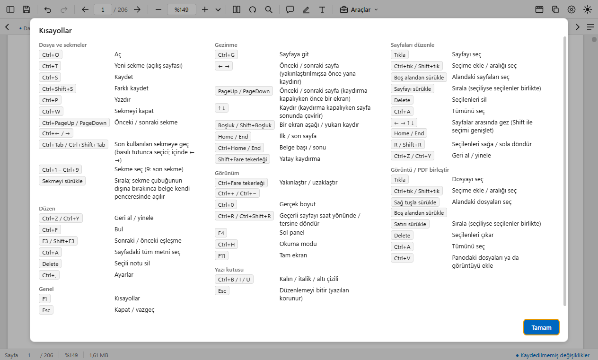

## Kurulum

### Windows

1. Yukarıdaki bağlantıdan `PDEfe-Setup.exe` dosyasını indirin (Windows 10/11, 64 bit; yönetici hakkı gerekmez).
2. Dosyaya **çift tıklayın**.
3. Dosya imzalı olmadığı için Windows SmartScreen uyarı gösterebilir: **Daha fazla bilgi** yazısına, sonra **Yine de çalıştır**
   düğmesine basın. Bu uyarı kod imzalama sertifikası olmadığından çıkar; her yeni sürümde tekrarlanabilir.
4. Sihirbaz Türkçedir: lisans, kurulum klasörü (varsayılan `%LOCALAPPDATA%\Programs\PDEfe`), **Ek görevler** sayfasında masaüstü
   kısayolu seçeneği. Başlat menüsüne **PDEfe** kısayolu eklenir ve `.pdf` dosyaları "Birlikte aç" menüsünde PDEfe ile görünür.
5. Son sayfada **PDEfe'yi başlat** ve **PDEfe'yi varsayılan PDF görüntüleyici yap** seçenekleri vardır.

### macOS

1. Yukarıdaki bağlantıdan `PDEfe-Mac.dmg` dosyasını indirin (macOS 13 Ventura ve sonrası; Apple işlemcili (M1 ve sonrası) ve Intel
   Mac'lerde aynı dosya).
2. Dosyayı açın; açılan pencerede **PDEfe**'yi **Uygulamalar** klasörüne sürükleyin.
3. PDEfe'yi Uygulamalar'dan açın. PDEfe Apple geliştirici imzası taşımadığı için macOS ilk açılışta uyarı verir ("Apple, PDEfe'nin
   kötü amaçlı yazılım içermediğini doğrulayamadı"): **Bitti**'ye basın, **Sistem Ayarları › Gizlilik ve Güvenlik**'i açın, sayfanın
   altındaki "PDEfe engellendi" satırında **Yine de Aç**'a basın ve parolanızla onaylayın. Yeni sürüm kurulunca yeniden istenebilir.
   (İletinin ve düğmenin adı macOS sürümüne göre değişebilir; macOS 13 ve 14'te Finder'da PDEfe'ye sağ tıklayıp **Aç** demek de olur.)
4. PDEfe bir klasördeki belgeye ilk kez eriştiğinde macOS Masaüstü, Belgeler ya da İndirilenler için izin sorabilir: **İzin Ver**.
5. Varsayılan PDF uygulaması yapmak için: Finder'da bir PDF'e sağ tıklayın › **Bilgi Al** › **Birlikte aç** listesinden **PDEfe** ›
   **Tümünü Değiştir**.

PDF'ler Finder'da çift tıklanarak (PDEfe varsayılan yapıldıysa), Birlikte aç'la ya da Dock'taki PDEfe simgesine bırakılarak açılır.
Hakkında, Güncellemeleri denetle ve Ayarlar ekranın üstündeki **PDEfe** menüsündedir. Son pencere kapanınca PDEfe de kapanır.

### Varsayılan PDF görüntüleyici yapma (Windows)

Windows 11'de varsayılan uygulamayı yalnızca kullanıcı seçebilir; kurulum bunu kendiliğinden değiştiremez. İki yol:

- Kurulumun son sayfasında **PDEfe'yi varsayılan PDF görüntüleyici yap** kutusunu işaretleyin: Windows Ayarlar'ın **Varsayılan
  uygulamalar › PDEfe** sayfası açılır; `.pdf` satırında **PDEfe**'yi seçin.
- Daha sonra: **Ayarlar › Uygulamalar › Varsayılan uygulamalar › PDEfe** ya da PDEfe içinde **Ayarlar › Açılış ve düzen › Varsayılan PDF
  görüntüleyici yap** (PDEfe zaten varsayılansa orada yeşil tik ve "Zaten varsayılan" görünür). Bir `.pdf` dosyasına sağ tıklayıp
  **Birlikte aç › Başka bir uygulama seç › PDEfe › Her zaman** de olur.

## Güncelleme

**Windows.** PDEfe haftada bir (son denetimden bu yana bir hafta geçtiyse açılışta; günlerce açık kalıyorsa gün içinde) GitHub'dan yeni
sürüm olup olmadığına bakar. Yeni sürüm varsa pencerenin üstünde **PDEfe X hazır (kullandığınız: Y).** şeridi çıkar. **Güncelle**
düğmesine bir kez basmak yeter: paket indirilir (yalnızca değişen kısımlar), kurulum sihirbazı açılmadan kurulur ve PDEfe kendiliğinden
yeni sürümle açılır. Kaydedilmemiş belge varsa önce sorulur; ayarlarınıza dokunulmaz. **Daha sonra** şeridi o oturum için gizler.
İstediğiniz an **Yardım › Güncellemeleri denetle** ya da **Ayarlar › Güncelleme › Şimdi denetle** ile hemen bakabilirsiniz; otomatik
denetim aynı yerden kapatılır.

**macOS.** PDEfe yeni sürümü aynı şeritle haber verir; **İndir** yeni `PDEfe-Mac.dmg`'yi tarayıcıda indirir. PDEfe'den çıkın (`⌘Q`),
indirilen dosyayı açıp PDEfe'yi yine Uygulamalar'a sürükleyin (**Değiştir**), sonra PDEfe'yi açın; macOS yeniden uyarırsa Kurulum'un 3.
adımındaki gibi **Yine de Aç**. Hemen bakmak için: **PDEfe › Güncellemeleri denetle…** ya da **Ayarlar › Güncelleme › Şimdi denetle**.

Sürüm notları: [CHANGELOG.md](CHANGELOG.md) ve [Sürümler sayfası](https://github.com/SCgrS/PDEfe/releases).

## Kaldırma

**Windows:** **Ayarlar › Uygulamalar › Yüklü uygulamalar › PDEfe › Kaldır**. Ayarlarınız (`%APPDATA%\PDEfe\ayarlar.json`) silinmez;
isterseniz o klasörü elle silebilirsiniz. Kurulum sistem klasörlerine ve HKLM'ye yazmaz.

**macOS:** Uygulamalar'dan PDEfe'yi Çöp Sepeti'ne sürükleyin; ayarlar `~/Library/Application Support/PDEfe` klasöründe kalır.

## Verileriniz

Bütün işlemler yereldir; belgeleriniz hiçbir yere gönderilmez, telemetri yoktur. Ağa yalnızca sürüm denetiminde (`github.com`) çıkılır.
Görsellerdeki yazıyı Windows'un (macOS'ta Apple'ın) kendi yazı tanıyıcısı bilgisayarda okur; tanınan yazı yalnızca PDEfe açıkken bellekte
tutulur, dosyaya ya da başka bir yere yazılmaz.

- Ayarlar `%APPDATA%\PDEfe\ayarlar.json` dosyasındadır (macOS'ta `~/Library/Application Support/PDEfe/ayarlar.json`). Son açılan
  belgelerin listesi ve belgelerde kalınan sayfalar da (dosya yollarıyla) bu dosyada tutulur; ikisi de Ayarlar › Açılış ve düzen'den
  kapatılır, kapatılınca kayıtları silinir (kalınan sayfalar Hatırlanan sayfaları temizle ile de silinir).
- Yapıştırılan ekran görüntüleri ve yazdırma için hazırlanan sayfa görüntüleri sistemin geçici klasöründe (`%TEMP%\PDEfe`, macOS'ta
  `$TMPDIR/PDEfe`) tutulur: yazdırma görüntüleri yazdırma bitince, ekran görüntüleri PDEfe kapanırken silinir; kalan olursa sonraki
  açılışta silinir.
- Sayfaları silinen, sıralanan ya da sayfa eklenen bir belge kaydedilirken özgün dosyanın bir kopyası ayarlar klasörünün altındaki
  `anlik` klasöründe tutulur (`%APPDATA%\PDEfe\anlik`, macOS'ta `~/Library/Application Support/PDEfe/anlik`); sekme kapanınca, kalırsa
  sonraki açılışta silinir.
- PDEfe bir dosyayı kaydederken dosyanın izinlerini ve "internetten indirildi" işaretini korur; yazma izni olmayan dosyanın üzerine
  yazmaz. Araçların ürettiği yeni PDF'lerde üretici olarak "PDEfe" yazar.
- Notlara yazılan yazar adı Ayarlar › Not ve vurgu › Yazar adı'ndadır (varsayılanı bilgisayardaki kullanıcı adınız: Windows'ta Windows
  kullanıcı adı, macOS'ta Mac'in kısa kullanıcı adı) ve kaydedilen notla birlikte PDF'e yazılır.

## Geliştirme

Gereksinimler: Node.js 22, Python 3.12 (proje içi `.venv`), Git. Windows'ta geliştirilir ve paketlenir; macOS paketi GitHub Actions'ta
derlenir (çekirdek Apple işlemcili ve Intel Mac'lerde ayrı derlenip tek evrensel DMG'ye konur, `.github/workflows/yayim.yml`).

```bash
git clone https://github.com/SCgrS/PDEfe.git
cd PDEfe
npm install

# Python çekirdeği için sanal ortam (uv ile; pip de olur). Sürümler CI'dakilerle aynı.
uv venv .venv --python 3.12
uv pip install --python .venv/Scripts/python.exe pymupdf==1.28.2 fonttools==4.65.0 pillow==12.3.0 pyinstaller==6.22.3
# görsellerdeki yazının tanınması (Windows yazı tanıyıcısının Python bağları)
uv pip install --python .venv/Scripts/python.exe winrt-runtime==3.2.1 winrt-Windows.Foundation==3.2.1 \
  winrt-Windows.Foundation.Collections==3.2.1 winrt-Windows.Globalization==3.2.1 winrt-Windows.Graphics.Imaging==3.2.1 \
  winrt-Windows.Media.Ocr==3.2.1 winrt-Windows.Storage.Streams==3.2.1

# macOS'ta: .venv/bin/python; yazı tanıma için winrt yerine Apple'ın tanıyıcısının bağları:
# uv pip install --python .venv/bin/python pymupdf==1.28.2 fonttools==4.65.0 pillow==12.3.0 pyinstaller==6.22.3 pyobjc-framework-Vision pyobjc-framework-Quartz

npm start                 # geliştirme: Electron + core/pdefe_core.py (.venv ile)
npm run cekirdek:derle    # PyInstaller → core/dist/pdefe-core/ (tek klasör)
npm run dist              # electron-builder → release/PDEfe-Setup.exe (önce cekirdek:derle; ikisini birden: npm run yayim:hazirla)
npm run test:araclar      # araçların çekirdek testleri
```

- Arayüz `src/renderer` altında derleme adımı olmayan ES modülleridir; ana süreç `src/main` (Node ESM).
- `core/pdefe_core.py` PyMuPDF tabanlı yardımcı süreçtir; ana süreçle stdio üzerinden satır başına bir JSON (JSON-RPC benzeri) konuşur.
  Uzun işler `progress` mesajları gönderir.
- Testler `test/` altında: arayüz senaryoları (`test/senaryo*.mjs`, `test/baslat.ps1` ile açılan ekran dışı örnekte `test/surucu.mjs`
  ile sürülür) ve çekirdek testleri (`test/*_testi.py`). README'deki ekran görüntüleri `test/readme_goruntuleri.mjs` ile üretilir.
- Paketleme yapılandırması `electron-builder.yml`, kurulum sihirbazı eklemeleri `build/installer.nsh`.
- Sürüm çıkarma: `package.json` sürümünü yükselt, `CHANGELOG.md`'ye bölüm ekle, `git tag vX.Y.Z` ve push; `.github/workflows/yayim.yml`
  paketleri derleyip GitHub Releases'e yükler (`PDEfe-Setup.exe`, `.blockmap`, `latest.yml`, `PDEfe-Mac.dmg`). Etiket `package.json`
  sürümüyle aynı olmalı (iş akışı denetler); Windows ve macOS paketlerinin ikisi de derlenip sınanınca sürüm yayımlanır, biri düşerse
  taslak kalır. macOS paketi yalnızca CI'da (`npx electron-builder --mac --universal`, iki mimarinin çekirdeğiyle) derlenir.
- Mimari ve kararlar: [PLAN.md](PLAN.md).

## Üçüncü taraf projeler

PDEfe şu açık kaynak projelerin üzerine kuruludur (sürümler ve lisanslar için [THIRD_PARTY.md](THIRD_PARTY.md)):

- **Electron** (MIT) — Chromium (BSD) ve Node.js (MIT) ile birlikte uygulama çatısı.
- **PDF.js / pdfjs-dist** (Apache-2.0, Mozilla) — sayfa çizimi, metin katmanı, yer imleri.
- **PyMuPDF** ve **MuPDF** (AGPL-3.0, Artifex) — belge işleme çekirdeği: notlar, kaydetme, küçük resimler.
- **Python** (PSF), **fontTools** (MIT), **Pillow** (MIT-CMU), **PyInstaller** (GPL-2.0, önyükleyici istisnası).
- **pywinrt** (MIT) — Windows'un yerleşik yazı tanıyıcısına (Windows.Media.Ocr) Python'dan erişim.
- **PyObjC** (MIT) — macOS'ta Apple'ın yerleşik yazı tanıyıcısına (Vision) Python'dan erişim.
- **electron-builder / electron-updater** (MIT), **electron-store** (MIT), **pdf-lib** (MIT), **NSIS** (zlib).

<!-- TEŞEKKÜR: kullanıcı onayı bekliyor — aşağıdaki bölüm proje sahibi onaylayınca yayımlanacak.
## Teşekkür

Bu uygulama, yukarıdaki projelerin geliştiricilerinin emeği üzerine kuruludur; her biri kendi lisansıyla
kullanıldı. Özellikle Mozilla'nın PDF.js ekibine ve Artifex'in MuPDF ekibine teşekkürler.
-->

## Lisans

PDEfe, **GNU Affero General Public License v3.0 (AGPL-3.0)** ile dağıtılır; tam metin [LICENSE](LICENSE)
dosyasındadır. PDF motoru olarak kullanılan MuPDF ve PyMuPDF AGPL-3.0 lisanslı olduğundan PDEfe de aynı
lisansı taşır: yazılımı kullanabilir, değiştirebilir ve dağıtabilirsiniz; değiştirilmiş sürümleri
dağıtırken (ağ üzerinden sunmak dahil) kaynak kodunu aynı lisansla açmanız gerekir.
